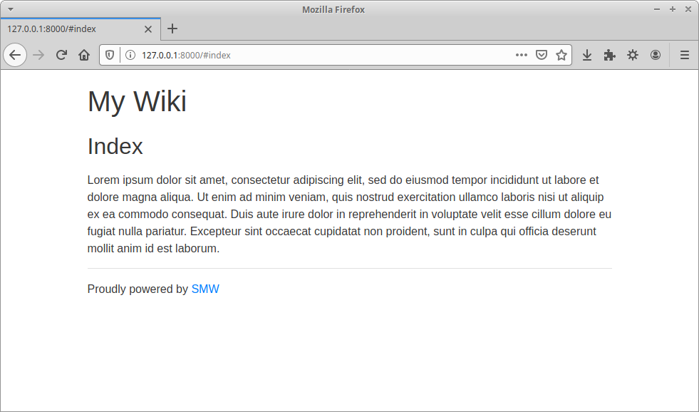

# SMW

## About

SMW is a one file Markdown wiki written in jQuery. SMW stands for Simple Markdown Wiki.

## Installation

```
wget https://raw.githubusercontent.com/tyea/smw/master/index.html
mkdir markdown
echo -e "## Index\n\nHello world" > markdown/index.md
```

## Screenshots



## Usage

### Hosting

Any web server which serves Markdown files with the correct `Content-Type` header will work fine. I have tested Apache and Nginx and they both work well.

If you want to try out SMW locally you can use Python. After running `python3 -m http.server` just browse to [http://127.0.0.0:8000](http://127.0.0.0:8000).

### Markdown

As shown above, you must create an `index.md` file in the `markdown` directory. Apart from that, how you organise your Markdown files is up to you.

### Linking

When linking between pages all you need to do is use the name of the Markdown file, without the `.md` extension, prefaced with a hash as the link.

For example, to link from the `foo.md` file to the `bar.md` file you would do `[Hello world](#bar)`.

### Images

If you want to use images there's nothing stopping you from creating an `images` directory next to the `markdown` directory. SMW only cares about the `markdown` directory being present, it will ignore anything else.

### Templating

If you want to customise the header, footer, or error template just create a `header.md`, `footer.md`, or `error.md` file in the `markdown` directory. The contents of those files will then be used instead of the defaults. These template files aren't required though, SMW will work fine without them.

## Author

Written by Tom Yeadon in July 2020.
